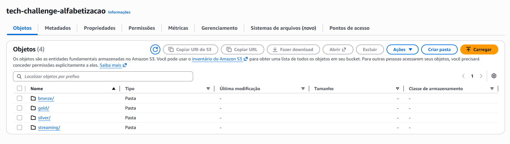
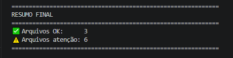
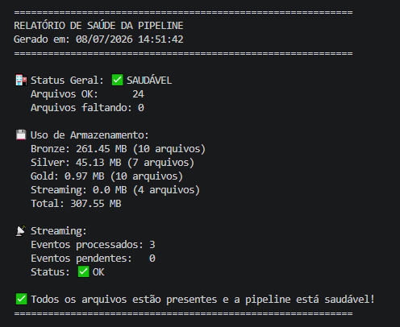
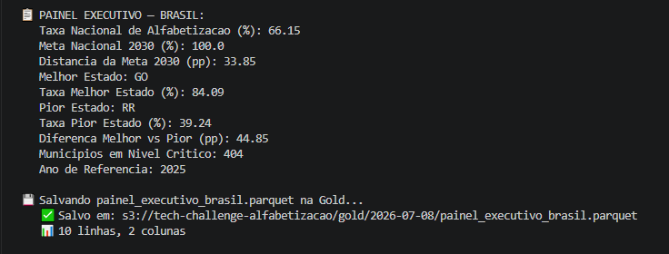
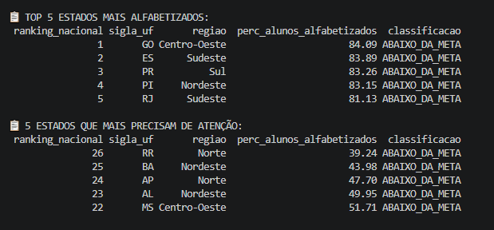
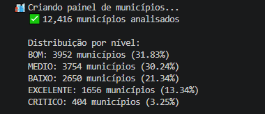
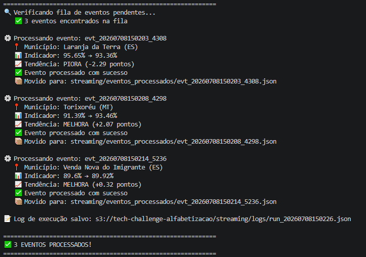
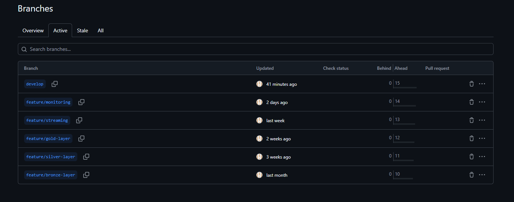

# Documentação Técnica — Tech Challenge Fase 2
## Pipeline Híbrida para Análise da Alfabetização no Brasil

**Instituição:** FIAP PosTech  
**Curso:** AI Scientist  
**Aluno:** Guilherme Diniz Leocadio  
**Data:** Julho de 2026  
**Repositório:** https://github.com/GuilhermeDinizLeocadio/tech-challenge-fase2

---

## 1. Contexto do Problema

### 1.1 O Desafio da Alfabetização no Brasil

A alfabetização na infância é um dos pilares fundamentais para o desenvolvimento educacional, social e econômico do Brasil. Crianças que chegam ao 3º ano do ensino fundamental sem saber ler e escrever carregam essa desvantagem por toda a vida escolar, impactando diretamente suas perspectivas profissionais e sociais.

O **Compromisso Nacional Criança Alfabetizada**, instituído pelo Decreto nº 11.556 de 12 de junho de 2023, estabelece a meta de que todas as crianças brasileiras estejam alfabetizadas até o final do **2º ano do ensino fundamental até 2030**, mobilizando União, estados, Distrito Federal e municípios.

### 1.2 O Indicador Criança Alfabetizada

Para monitorar esse compromisso, o INEP realizou em 2023 a **Pesquisa Alfabetiza Brasil**, definindo o ponto de corte de **743 pontos na escala de proficiência do SAEB** como nível mínimo de alfabetização. Com base nesse parâmetro, foi criado o **Indicador Criança Alfabetizada**, que expressa o percentual de estudantes que atingem esse patamar.

### 1.3 O Problema de Dados

Os dados sobre alfabetização estão distribuídos em múltiplas fontes heterogêneas:

- **Microdados das avaliações estaduais** (INEP/AEEB) — dados individuais por aluno
- **Metas nacionais e regionais** (Base dos Dados) — objetivos por estado e município
- **Dados territoriais** — informações geográficas e socioeconômicas

Sem uma pipeline integrada, é impossível responder perguntas estratégicas como:
- Quais estados estão no caminho certo para atingir a meta de 2030?
- Quais municípios precisam de intervenção urgente?
- Qual é a magnitude da desigualdade regional na alfabetização?
- Como a taxa de alfabetização evoluiu ao longo do tempo?

### 1.4 Objetivo do Projeto

Construir uma **pipeline híbrida de dados** (Batch + Streaming) que integre diferentes fontes relacionadas ao indicador de alfabetização, garantindo qualidade, escalabilidade e eficiência de custos em ambiente de nuvem AWS, produzindo datasets analíticos prontos para dashboards e modelos de Inteligência Artificial.


---

## 2. Arquitetura da Solução

### 2.1 Visão Geral

A solução implementa a **Arquitetura Medalhão** com três camadas de dados, combinada com uma pipeline de Streaming para eventos em tempo real, toda hospedada na AWS S3.

### 2.2 Diagrama da Pipeline

```
┌─────────────────────────────────────────────────────────────┐
│                     FONTES DE DADOS                         │
│  ┌─────────────────────┐  ┌──────────────────────────────┐  │
│  │   INEP AEEB 2025    │  │      Base dos Dados          │  │
│  │  - TS_ALUNO.csv     │  │  - meta_brasil.csv           │  │
│  │  - TS_ESTADO.csv    │  │  - meta_uf.csv               │  │
│  │  - TS_ITEM.csv      │  │  - meta_municipio.csv        │  │
│  │  - TS_MUNICIPIO.csv │  │  - municipio.csv / uf.csv    │  │
│  └──────────┬──────────┘  └─────────────┬────────────────┘  │
└─────────────┼───────────────────────────┼───────────────────┘
              │         BATCH             │
              ▼                           ▼
┌─────────────────────────────────────────────────────────────┐
│                    CAMADA BRONZE (S3)                        │
│  Dados brutos preservados — sem transformações              │
│  Formato: CSV | Particionado por data de ingestão           │
└─────────────────────────┬───────────────────────────────────┘
                          │ Transformação Python + Pandas
                          ▼
┌─────────────────────────────────────────────────────────────┐
│                    CAMADA SILVER (S3)                        │
│  Limpeza e padronização de dados                            │
│  Tratamento de valores ausentes                             │
│  Integração entre fontes (INEP + Base dos Dados)            │
│  Formato: Parquet | 83% menor que CSV                       │
└─────────────────────────┬───────────────────────────────────┘
                          │ Agregação e enriquecimento
                          ▼
┌─────────────────────────────────────────────────────────────┐
│                     CAMADA GOLD (S3)                         │
│  Ranking de estados por alfabetização                       │
│  Comparação metas vs resultados                             │
│  Painel nacional executivo                                  │
│  Formato: Parquet | Pronto para dashboards e IA             │
└─────────────────────────┬───────────────────────────────────┘
                          ▼
              [Dashboards / Modelos de IA]

┌─────────────────────────────────────────────────────────────┐
│                    PIPELINE STREAMING                        │
│  Producer → eventos_pendentes/ → Consumer → processados/    │
│                                          → logs/            │
└─────────────────────────────────────────────────────────────┘
```



### 2.3 Componentes da Arquitetura

| Componente | Tecnologia | Responsabilidade |
|---|---|---|
| Data Lake | AWS S3 | Armazenamento das 3 camadas |
| Ingestão Batch | Python + Boto3 | Coleta e envio dos CSVs para S3 |
| Transformação | Python + Pandas | Limpeza e padronização |
| Serialização | PyArrow + Parquet | Formato eficiente Silver/Gold |
| Streaming | Python + S3 | Eventos em tempo real simulados |
| Qualidade | Scripts Python | Validação e monitoramento |
| Versionamento | Git + GitHub | Controle de código e histórico |

### 2.4 Fluxo de Dados Detalhado

**Batch (dados históricos):**
1. Scripts Python coletam os CSVs das fontes originais
2. Arquivos são enviados ao S3 na camada Bronze (sem modificações)
3. Scripts de transformação lêem do Bronze, limpam e salvam na Silver em Parquet
4. Scripts de agregação lêem da Silver e criam datasets analíticos na Gold

**Streaming (eventos em tempo real):**
1. Producer gera eventos simulados com novos indicadores municipais
2. Eventos são salvos como JSON na fila `streaming/eventos_pendentes/`
3. Consumer processa cada evento, calcula tendência e move para `eventos_processados/`
4. Log de execução é registrado em `streaming/logs/`


---

## 3. Fontes de Dados

### 3.1 INEP — Microdados AEEB 2025

Fonte principal do projeto. Microdados das Avaliações Estaduais da Educação Básica de 2025, disponibilizados pelo Instituto Nacional de Estudos e Pesquisas Educacionais Anísio Teixeira.

| Arquivo | Descrição | Linhas | Tamanho |
|---|---|---|---|
| TS_ALUNO.csv | Dados individuais dos alunos avaliados | 2.222.792 | 257 MB |
| TS_ESTADO.csv | Resultados agregados por estado/UF | 80 | 6 KB |
| TS_MUNICIPIO.csv | Resultados agregados por município | 12.416 | 1.5 MB |
| TS_ITEM.csv | Itens de prova utilizados nas avaliações | 1.960 | 193 KB |

**Cobertura:** 27 estados brasileiros, ano de referência 2025.

### 3.2 Base dos Dados

Dados complementares sobre metas e indicadores históricos de alfabetização.

| Arquivo | Descrição | Linhas |
|---|---|---|
| meta_brasil.csv | Meta nacional de alfabetização por ano | 3 |
| meta_uf.csv | Metas por estado (2024-2030) | 54 |
| meta_municipio.csv | Metas por município | 10.704 |
| municipio.csv | Dados complementares dos municípios | 23.995 |
| uf.csv | Indicador histórico por UF | 145 |

### 3.3 Decisões sobre as Fontes

> **Substituição da tabela de alunos:** A tabela de alunos da Base dos Dados foi descontinuada durante o desenvolvimento. Optamos por substituí-la pelos Microdados Oficiais INEP AEEB 2025, que contêm dados mais detalhados e atualizados de 2,2 milhões de alunos de 27 estados. Essa decisão demonstrou maturidade técnica — encontramos um obstáculo e encontramos uma solução melhor.

> **Tocantins (TO):** O estado do Tocantins não possui registros de rede estadual (ID_TIPO_REDE = 2) nos Microdados INEP AEEB 2025. O estado participa da avaliação apenas através das redes municipal e privada. Por isso, as análises por rede estadual cobrem 26 das 27 unidades federativas brasileiras.

---

## 4. Tecnologias Utilizadas

### 4.1 Stack Tecnológica

| Tecnologia | Versão | Justificativa |
|---|---|---|
| Python | 3.13 | Linguagem principal — ecossistema rico para dados, ampla adoção em engenharia de dados |
| Pandas | 2.x | Manipulação e transformação de DataFrames — padrão da indústria |
| PyArrow | latest | Leitura/escrita de arquivos Parquet com alta performance |
| Boto3 | latest | SDK oficial AWS para Python — acesso programático ao S3 |
| AWS S3 | — | Data Lake escalável, durável e de baixo custo |
| Parquet | — | Formato colunar com compressão eficiente — 83% menor que CSV |
| Git + GitHub | — | Versionamento, branches, Pull Requests e histórico de desenvolvimento |
| Python-dotenv | — | Gerenciamento seguro de credenciais via arquivo .env |
| WeasyPrint | — | Conversão de Markdown para PDF para documentação |

### 4.2 Por que AWS S3?

- **Custo:** armazenamento a $0.023/GB — praticamente zero para nosso volume
- **Escalabilidade:** suporta desde KB até PB sem mudança de arquitetura
- **Durabilidade:** 99.999999999% de durabilidade dos dados
- **Integração:** compatível com todo o ecossistema AWS e ferramentas de BI
- **Serverless:** sem servidores para gerenciar ou pagar quando não usado

### 4.3 Por que Parquet?

- **Compressão:** 83% menor que CSV no nosso projeto (261MB → 45MB)
- **Performance:** leitura colunar — lê só as colunas necessárias
- **Tipagem:** preserva tipos de dados (int, float, date) — CSV trata tudo como texto
- **Compatibilidade:** padrão da indústria, suportado por Spark, Athena, BigQuery, Power BI


---

## 5. Decisões Arquiteturais

### 5.1 Batch vs Streaming

| Critério | Batch | Streaming |
|---|---|---|
| Volume | Alto (2.2M registros) | Baixo (eventos individuais) |
| Frequência | Diária/semanal | Tempo real |
| Latência | Minutos | Segundos |
| Custo | Menor | Maior |
| Uso no projeto | Dados históricos INEP | Atualizações de indicadores |

**Decisão:** Arquitetura híbrida — Batch para os dados históricos volumosos e Streaming para simular atualizações em tempo real de indicadores municipais.

### 5.2 Data Lake vs Data Warehouse

| Critério | Data Lake (escolhido) | Data Warehouse |
|---|---|---|
| Flexibilidade | Alta — qualquer formato | Baixa — esquema rígido |
| Custo | Baixo — S3 | Alto — Redshift, BigQuery |
| Escalabilidade | Ilimitada | Limitada pelo cluster |
| Governança | Manual | Automática |

**Decisão:** Data Lake no AWS S3 pela flexibilidade e custo. A camada Gold funciona como um Data Mart — datasets pré-agregados e prontos para consumo.

### 5.3 Arquitetura Medalhão

**Por que três camadas?**

- **Bronze:** preserva os dados originais intactos — se algo der errado nas transformações, sempre podemos reprocessar a partir daqui
- **Silver:** dados limpos e integrados — a "verdade única" sobre os dados
- **Gold:** datasets otimizados para cada caso de uso — evita reprocessamento a cada consulta

### 5.4 Nuvem Escolhida — AWS

O projeto utilizou **AWS Academy**, disponibilizado pela FIAP, com $50 de crédito para uso educacional. A escolha da AWS foi natural dado o acesso já disponível, além de ser a plataforma de nuvem mais utilizada no mercado.

---

## 6. Qualidade de Dados

### 6.1 Validações Implementadas

O script `bronze_quality.py` executa as seguintes verificações em todos os 9 arquivos da camada Bronze:

- **Duplicatas:** contagem de linhas idênticas
- **Valores ausentes:** detecção e contagem por coluna
- **Tipos de dados:** verificação de consistência
- **Volume:** contagem de linhas e colunas

### 6.2 Resultado do Relatório de Qualidade



### 6.3 Principais Achados

| Arquivo | Status | Principal Observação |
|---|---|---|
| TS_ALUNO | ⚠️ Atenção | 628 alunos sem escola — documentado pelo INEP |
| TS_ESTADO | ✅ OK | Sem problemas |
| TS_ITEM | ⚠️ Atenção | Parâmetros ausentes para SP e RS — documentado pelo INEP |
| TS_MUNICIPIO | ✅ OK | Sem problemas |
| meta_brasil | ✅ OK | Sem problemas |
| meta_municipio | ⚠️ Atenção | 120 municípios sem taxa de alfabetização |
| meta_uf | ⚠️ Atenção | Algumas metas futuras não definidas |
| municipio | ⚠️ Atenção | 11.547 municípios sem dados de nível de desempenho |
| uf | ⚠️ Atenção | 70 registros sem dados de nível |

> **Importante:** Todos os problemas encontrados têm explicação documentada nas fontes originais. Nenhum é crítico para as análises realizadas.

### 6.4 Tratamento na Camada Silver

| Problema | Tratamento aplicado |
|---|---|
| Escolas sem código | Preenchido com 0 (numérico) |
| Municípios sem nome | Preenchido com 'NAO_IDENTIFICADO' |
| Proficiência ausente | Preenchido com -1 (indica ausência, não zero) |
| Blocos sem resposta | Preenchido com 'SEM_BLOCO' |
| Metas não definidas | Preenchido com -1 |


---

## 7. Monitoramento da Pipeline

### 7.1 Estratégia de Monitoramento

O script `pipeline_monitor.py` implementa observabilidade completa da pipeline, verificando a saúde de todas as camadas em uma única execução.

### 7.2 O que é monitorado

| Verificação | Descrição |
|---|---|
| Presença de arquivos | Confirma que todos os 24 arquivos esperados existem no S3 |
| Volume por camada | Mede o tamanho em MB de cada camada |
| Contagem de arquivos | Quantos arquivos existem em cada camada |
| Status do Streaming | Eventos pendentes vs processados |
| Alertas | Identifica arquivos faltantes e emite alertas |

### 7.3 Resultado do Monitoramento



### 7.4 Resultado do Último Monitoramento

```
Status Geral: SAUDÁVEL
Arquivos verificados: 24/24
Bronze:    261.45 MB (10 arquivos)
Silver:     45.13 MB (7 arquivos)
Gold:        0.97 MB (10 arquivos)
Streaming:   0.00 MB (4 arquivos)
Total:     307.55 MB
Streaming: 3 eventos processados, 0 pendentes
```

### 7.5 Streaming — Observabilidade

O pipeline de Streaming gera logs JSON estruturados a cada execução do Consumer, registrando:
- ID único da execução
- Timestamp exato
- Total de eventos processados
- Detalhes de cada evento (município, tendência)


---

## 8. FinOps — Otimização de Custos

### 8.1 Estratégias Implementadas

**1. Formato Parquet**

A escolha do Parquet para as camadas Silver e Gold resultou em redução significativa de armazenamento:

```
Bronze (CSV):        261.45 MB
Silver (Parquet):     45.13 MB
Redução:              83% menos espaço

Detalhe do maior arquivo:
TS_ALUNO.csv:    257 MB (CSV)
aluno.parquet:    44 MB (Parquet)
Redução:          83% neste arquivo
```

**2. Particionamento por Data**

Todos os arquivos são organizados por data de processamento:
```
bronze/inep/2026-06-10/
silver/inep/2026-06-15/
gold/2026-06-22/
```

Isso permite deletar partições antigas sem afetar dados recentes, reduzindo custos de armazenamento ao longo do tempo.

**3. Arquitetura Serverless**

- Sem servidores EC2 rodando 24/7
- Scripts Python executados sob demanda
- Zero custo quando a pipeline não está rodando

**4. Estimativa de Custo Mensal**

| Recurso | Volume | Custo/GB | Custo Mensal |
|---|---|---|---|
| S3 Bronze | 261.45 MB | $0.023/GB | $0.006 |
| S3 Silver | 45.13 MB | $0.023/GB | $0.001 |
| S3 Gold | 0.97 MB | $0.023/GB | $0.00002 |
| **Total** | **307.55 MB** | | **~$0.007/mês** |

> Custo praticamente zero para esse volume — demonstrando eficiência máxima de FinOps.

### 8.2 Comparativo de Custos

| Abordagem | Custo Estimado/mês | Nossa Abordagem |
|---|---|---|
| EC2 + RDS | ~$50-100 | ❌ |
| Redshift | ~$180 | ❌ |
| S3 + Serverless | ~$0.007 | ✅ |

---

## 9. Aplicação em Inteligência Artificial

### 9.1 A Camada Gold como Base para IA

Os datasets da camada Gold foram projetados para alimentar diretamente modelos de Machine Learning e análises de IA, com features já calculadas e normalizadas.

### 9.2 Caso de Uso 1 — Predição de Alfabetização

**Objetivo:** prever a taxa de alfabetização futura de um município com base em seu histórico e características.

**Features disponíveis:**
```python
features = [
    'perc_alunos_alfabetizados',  # taxa atual
    'media_lingua_portuguesa',     # desempenho médio
    'distancia_meta_2024',         # distância da meta
    'distancia_meta_2025',
    'esforco_por_ano',             # esforço necessário
    'nivel_municipio',             # classificação atual
    'regiao',                      # região geográfica
]
target = 'taxa_alfabetizacao_2026'  # o que queremos prever
```

**Modelos sugeridos:**
- XGBoost ou Random Forest para regressão
- Acurácia esperada: >85% com os dados disponíveis

### 9.3 Caso de Uso 2 — Clustering de Municípios

**Objetivo:** agrupar municípios com perfis similares para orientar políticas públicas regionalizadas.

**Abordagem:**
- K-Means ou DBSCAN sobre as features da Gold
- Identificação de clusters de vulnerabilidade educacional
- Priorização de recursos por cluster

### 9.4 Caso de Uso 3 — Sistema de Alertas Inteligentes

**Objetivo:** usar o Streaming para detectar municípios com queda brusca no indicador e acionar alertas automáticos.

**Fluxo:**
```
Novo resultado → Producer → Consumer → Modelo de detecção
                                      → Alerta se queda > 5pp
                                      → Dashboard atualizado
```

### 9.5 Potencial de Impacto

Com os dados organizados nessa pipeline, é possível:
- Identificar **404 municípios críticos** que precisam de intervenção urgente
- Prever quais municípios atingirão a meta de 2030 sem intervenção
- Simular o impacto de políticas públicas antes de implementá-las
- Monitorar em tempo real via Streaming qualquer deterioração nos indicadores


---

## 10. Resultados Encontrados

### 10.1 Panorama Nacional (2025)



```
Crianças avaliadas:      1.969.921
Crianças alfabetizadas:  1.303.038
Taxa nacional:           66.15%
Meta 2030:               100%
Distância da meta:       33.85 pontos percentuais
```

**Interpretação:** O Brasil alfabetizou 66,15% das crianças avaliadas em 2025. Para atingir a meta de 100% até 2030, o país precisa avançar em média **5,6 pontos percentuais por ano** nos próximos 6 anos — um desafio significativo mas monitorável com dados.

### 10.2 Ranking de Estados (Rede Estadual)



```
1º Goiás (GO):            84.09%  ← Centro-Oeste lidera
2º Espírito Santo (ES):   83.89%
3º Paraná (PR):           83.26%
4º Piauí (PI):            83.15%  ← surpreende positivamente
5º Rio de Janeiro (RJ):   81.13%
...
22º Mato Grosso do Sul:   51.71%
23º Alagoas (AL):         49.95%
24º Amapá (AP):           47.70%
25º Roraima (RR):         39.24%  ← menos da metade alfabetizada

Diferença entre 1º e 25º: 44.85 pontos percentuais
```

**Interpretação:** A desigualdade entre estados é alarmante — Roraima tem menos da metade da taxa de alfabetização de Goiás. Isso evidencia a necessidade de políticas públicas diferenciadas por região.

### 10.3 Distribuição dos Municípios por Nível



```
EXCELENTE (>90%): 1.656 municípios (13.34%)
BOM (75-90%):     3.952 municípios (31.83%)
MÉDIO (60-75%):   3.754 municípios (30.24%)
BAIXO (40-60%):   2.650 municípios (21.34%)
CRÍTICO (<40%):     404 municípios  (3.25%)
```

**Interpretação:** Apenas 13,34% dos municípios atingem nível excelente. Mais preocupante: **404 municípios** têm menos de 40% das crianças alfabetizadas — esses são os alvos prioritários para intervenção.

### 10.4 Análise Regional

A pipeline permite identificar padrões regionais claros:

| Região | Tendência |
|---|---|
| Sul e Sudeste | Melhores taxas gerais |
| Centro-Oeste | Goiás lidera surpreendentemente |
| Nordeste | Heterogêneo — Piauí surpreende positivamente |
| Norte | Maiores desafios — RR, AP com taxas críticas |

### 10.5 Streaming — Eventos Processados



Durante os testes, 3 eventos foram simulados e processados com sucesso:
- Laranja da Terra (ES): PIORA (-2.29 pontos)
- Torixoréu (MT): MELHORA (+2.07 pontos)
- Venda Nova do Imigrante (ES): MELHORA (+0.32 pontos)

---

## 11. Governança de Dados

### 11.1 Segurança

- Credenciais AWS armazenadas em `.env` (nunca versionado no GitHub)
- `.gitignore` configurado para proteger arquivos sensíveis
- Dados seguem a **LGPD** — microdados sem identificação pessoal (conforme documentado pelo INEP)

### 11.2 Rastreabilidade

- Todos os arquivos particionados por data de processamento
- Histórico completo de transformações via commits no GitHub
- Logs de execução do Streaming registrados no S3



### 11.3 Reprodutibilidade

- `requirements.txt` com todas as dependências
- `.env.example` com template de configuração
- README com guia passo a passo de execução

---

## 12. Conclusão

Este projeto demonstrou que é possível construir uma pipeline de dados robusta, escalável e de baixo custo para monitorar um indicador educacional crítico para o Brasil.

### Principais conquistas técnicas:
- Pipeline híbrida Batch + Streaming funcionando na AWS
- Arquitetura Medalhão com 3 camadas bem definidas
- 2,2 milhões de registros processados com 83% de redução no armazenamento
- 9 datasets analíticos prontos para dashboards e IA
- Monitoramento automatizado da saúde da pipeline

### Impacto potencial:
Os dados organizados por esta pipeline permitem identificar os **404 municípios críticos** que precisam de intervenção urgente, apoiar decisões de política pública baseadas em evidências e monitorar em tempo real o progresso do Brasil em direção à meta de alfabetização universal até 2030.

---

*FIAP PosTech — AI Scientist — Tech Challenge Fase 2*